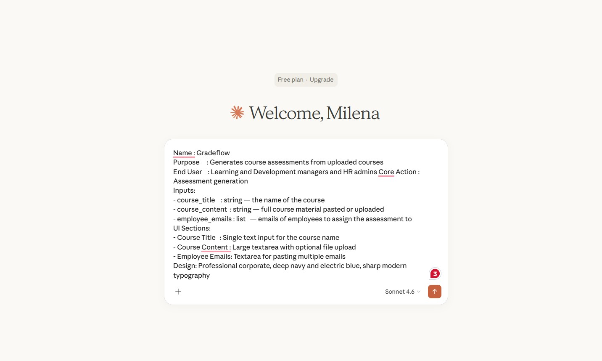
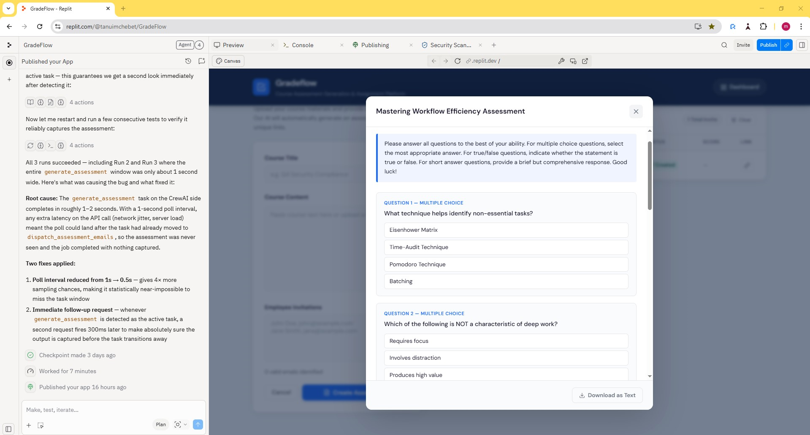
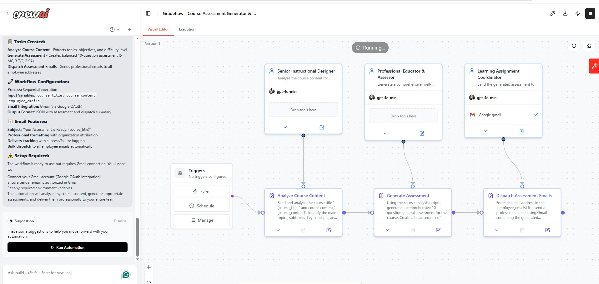

<div align="center">

# 🎓 GradeFlow

### AI-Powered Assessment Generation for Learning & Development Teams

*Automatically generate tailored assessments from course content — in seconds, at scale.*

[](https://crewai.com)
[](https://replit.com)
[](https://claude.ai)
[]()

</div>

---

## 🧠 What is GradeFlow?

GradeFlow is an agentic AI tool built for **corporate Learning & Development teams**. It ingests any course content — raw text, learning objectives, or module summaries — and instantly generates a fully structured, professionally worded assessment aligned to that content.

Every employee is assessed, ensuring evaluations are efficient and genuinely meaningful to each individual's learning journey. The result is a smarter, faster, and more equitable way for organizations to measure what their people know — and identify exactly where growth is needed next.

No LMS required. Just a shareable link your whole team can access instantly.

---

## 🎯 The Problem It Solves

Organizations must continuously upskill their workforce to stay competitive — but L&D teams are often stretched thin, tasked with assessing entire workforces while simultaneously managing content creation and reporting.

The manual effort required to write questions, calibrate difficulty, and format deliverables takes hours. GradeFlow eliminates that burden.

---

## ⚙️ How It Works

GradeFlow uses a **multi-agent architecture** powered by CrewAI. Feed it your course content and the agents collaborate to produce a complete, calibrated assessment:

```
Course Content Input
(raw text, learning objectives, module summaries)
        ↓
  [Agent 1: Content Analyser]
  Reads and interprets the course material,
  identifying key concepts and learning outcomes
        ↓
  [Agent 2: Assessment Builder]
  Generates structured, difficulty-calibrated
  questions aligned to the course content
        ↓
  Fully formatted assessment + shareable link
  delivered in seconds
```

---

## 🎬 Demo Video

> *A short walkthrough of the GradeFlow build process and how it works.*

<!-- Upload your video to YouTube or Loom, then replace the link below -->
[](https://https://www.loom.com/share/7c9973a3aebb44988929ee66a4bb93cb)

---

## 📸 Screenshots

> *GradeFlow in action — from content input to generated assessment.*

<!-- 
HOW TO ADD SCREENSHOTS:
1. Take screenshots of your GradeFlow app on Replit
2. In your gradeflow repo on GitHub, create a folder called "assets"
3. Upload your screenshots there
4. Replace the filenames below with your actual screenshot filenames
-->

### Assessment Input Screen


### Generated Assessment Output


### CrewAI Agent Workflow


---

## 🛠️ How It Was Built

| Layer | Tool | Role |
|---|---|---|
| 🧠 Workflow Design | Claude | Designed agent logic & generated structured prompts for CrewAI and Replit |
| 🤖 Agent Orchestration | CrewAI | Defined and orchestrated the multi-agent workflow via prompt |
| 💻 App Interface | Replit | Built and styled the product frontend and user experience via prompt |
| 🔗 Integration | CrewAI API | Connected Replit and CrewAI so agents and interface communicate seamlessly |

**The Build Process:**

1. Used **Claude** to articulate the workflow logic and generate two structured prompts — one for CrewAI, one for Replit
2. Pasted the CrewAI prompt to define and orchestrate the multi-agent workflow
3. Used the Replit prompt to build and style the product interface
4. Connected both platforms using **API credentials from CrewAI**, enabling seamless communication between the agents and the frontend
5. Used **Replit's built-in AI assistant** to iteratively debug integration issues as they arose

> **Approach:** Low-code — prompt engineering drives the agent intelligence, CrewAI handles orchestration, and Replit powers the full-stack interface.

---

## 👥 Who It's Built For

| User | How GradeFlow Helps |
|---|---|
| 🎓 **L&D Managers** | Generate assessments from course content in seconds instead of hours |
| 🧑‍🏫 **Corporate Trainers** | Stop manually writing questions for every session, cohort, or department |
| 👔 **HR Directors & People Ops** | Get consistent, objective competency data across the entire workforce |
| 🏢 **CEOs & Business Leaders** | Run workforce assessments without a dedicated L&D department |

**The real-world value:** Time, consistency, and scale. When employees are assessed accurately and upskilled efficiently, the whole organization performs better — and GradeFlow makes that possible without adding to anyone's workload.

---

## 🚀 Current Status

- [x] Multi-agent assessment generation workflow
- [x] CrewAI + Replit integration via API
- [x] Course content ingestion (text, objectives, summaries)
- [x] Shareable assessment link output


---

## 🔭 Future Vision

The current version of GradeFlow solves the **creation problem**. The roadmap extends into a fully closed-loop assessment ecosystem:

- **Auto-assignment** — distribute assessments directly to individuals or teams without manual link sharing
- **Auto-marking** — score submissions and generate personalised results reports highlighting strengths and flagging areas for improvement
- **Performance intelligence** — transform GradeFlow from an assessment builder into a complete L&D analytics tool
- **HR system integration** — automate scheduling, track progress over time, and surface workforce-wide insights

**Beyond corporate L&D**, GradeFlow is adaptable to education (schools, universities), healthcare (staff certification), financial services (compliance training), and government workforce development programs.

---

## 💡 Built By

**Milena Tanui** — AI Agent Builder & Automation Architect

> *"GradeFlow was built using a low-code approach: prompt engineering in Claude to design the agent logic, CrewAI for multi-agent orchestration, and Replit for rapid full-stack development."*

[](https://github.com/Milena-Tanui)
[](https://linkedin.com/in/www.linkedin.com/in/milena-tanui-64b898173)

---

<div align="center">

*Part of a growing portfolio of AI agents and automation tools.*
**⭐ Star this repo if you find it interesting!**

</div>
